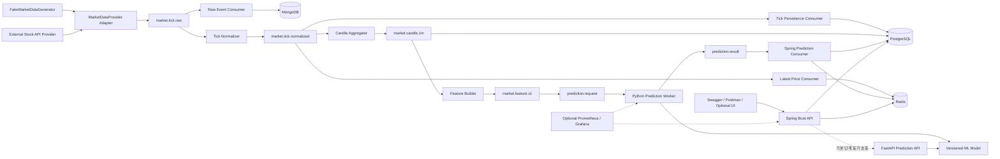

# System Overview

## 목적

이 문서는 시스템 컴포넌트의 경계와 데이터 흐름을 설명한다. 상세 구현은 해당 마일스톤에서
결정하며, 구조 변경은 ADR로 근거를 남긴다.

## 전체 구조

## 컴포넌트 책임

| 컴포넌트 | 책임 |
|---|---|
| FakeMarketDataGenerator | seed 기반 정상·중복·지연·invalid tick 생성 |
| External Stock API Provider | 실제 API 인증, rate limit, reconnect와 원본 응답 수신 |
| MarketDataProvider Adapter | fake와 실제 공급자를 동일 내부 raw 계약으로 변환 |
| Kafka | 이벤트 전달, consumer 분리, 완충, replay와 lag 관찰 |
| Spring Boot API | Java 도메인, REST API, consumer orchestration과 저장 결과 제공 |
| PostgreSQL | 정규화 tick, candle, prediction, model과 backtest의 기준 데이터 |
| MongoDB | 공급자 원본 payload와 파싱 실패 증거 보존 |
| Redis | latest price, latest prediction 등 재생성 가능한 최신 상태 |
| FastAPI | 동기 ML API, feature schema 검증과 model loading |
| Python Worker | 비동기 prediction request 소비와 result 발행 |
| Monitoring | 처리율, latency, consumer lag, DLQ, cache와 prediction 관측 |

## 주요 데이터 흐름

1. fake 또는 real provider가 raw tick을 생성한다.
2. adapter가 공통 envelope로 `market.tick.raw`에 발행한다.
3. raw archiver가 MongoDB에 원본을 저장한다.
4. normalizer가 유효성, timezone, decimal과 schema를 정규화한다.
5. normalized tick을 PostgreSQL에 저장하고 Redis latest 값을 갱신한다.
6. event time 기준 1분 window로 OHLCV candle을 만든다.
7. 완료 candle window에서 versioned feature를 만든다.
8. 기본 단계에서는 Spring이 FastAPI를 동기로 호출한다.
9. 확장 단계에서는 prediction request/result topic으로 추론을 비동기화한다.
10. prediction 결과를 PostgreSQL에 보존하고 Redis에 latest projection을 만든다.
11. Spring API가 latest price, candle, prediction, model과 backtest를 제공한다.

## 공통 이벤트 envelope

핵심 이벤트는 다음 필드를 공통으로 가진다.

| 필드 | 의미 |
|---|---|
| `eventId` | 중복 제거와 추적을 위한 고유 ID |
| `eventType` | 이벤트 종류 |
| `schemaVersion` | producer/consumer 계약 version |
| `source` | FAKE 또는 외부 provider |
| `ticker` | 종목 식별자와 Kafka key 후보 |
| `occurredAt` | 시장 또는 source에서 발생한 event time |
| `receivedAt` | 시스템이 수신한 processing 기준 시각 |
| `traceId` | 파이프라인 상관관계 ID |
| `payload` | 이벤트별 데이터 |

가격은 binary floating point 오차를 피할 수 있도록 decimal-safe 표현을 사용한다.

## Topic 후보

- `market.tick.raw`
- `market.tick.normalized`
- `market.candle.1m`
- `market.feature.v1`
- `prediction.request`
- `prediction.result`
- `market.event.dlq`
- `prediction.event.dlq`

동일 ticker의 순서가 필요한 topic은 `exchange:ticker`를 message key로 사용한다. topic 전체의
전역 순서가 아니라 동일 partition 내부의 순서를 기준으로 설계한다.

## 저장소 후보

### PostgreSQL

- `stocks`
- `market_ticks`
- `stock_candles`
- `predictions`
- `model_versions`
- `backtest_results`
- 선택: `users`, `watchlists`

### MongoDB

- `raw_market_events`
- `raw_api_payloads`
- 선택: `news_articles`, `dart_filings`

### Redis

- `stock:price:{exchange}:{ticker}:latest`
- `prediction:latest:{exchange}:{ticker}:{horizon}`
- 선택: `watchlist:user:{userId}`
- 선택: `rate:user:{userId}:{bucket}`
- 선택: `rank:gainers:{market}`

## 신뢰성과 장애 원칙

- 기본 전달 보장은 at-least-once로 두고 consumer를 멱등하게 만든다.
- 외부 side effect가 성공하기 전에 offset을 완료 처리하지 않는다.
- 중복 event와 request는 unique key 또는 처리 기록으로 성공 취급한다.
- Validation처럼 영구적인 오류는 반복 retry하지 않는다.
- 일시적 network 오류만 제한된 backoff retry 후 DLQ로 보낸다.
- Redis 실패가 가격과 prediction history 조회 전체 장애로 확산되지 않게 PostgreSQL fallback을 둔다.
- 늦은 tick이 latest 값을 덮지 않도록 event time 또는 provider sequence를 비교한다.
- Kafka transaction만으로 Kafka와 외부 DB의 원자성이 완성된다고 가정하지 않는다.
- DB에서 Kafka로 발행해야 하는 원자적 흐름은 필요 시 outbox를 고도화 단계에서 검토한다.

## ML 기준선

- 1차 목표 후보: 완료된 1분 candle을 사용한 다음 5분 방향 분류
- 모델 순서: DummyClassifier -> Logistic Regression -> tree boosting 비교
- random split을 사용하지 않고 시간 순서를 유지한다.
- 학습과 추론에서 동일한 versioned feature 함수를 사용한다.
- model version, feature version, training period, metric과 artifact checksum을 기록한다.
- 예측 정확도와 거래 비용 반영 수익을 별도로 평가한다.
